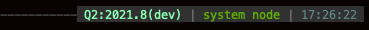

# zsh-qiime2

Hi there, [QIIME 2](https://qiime2.org) users and developers! This is a small [oh-my-zsh](https://github.com/ohmyzsh/ohmyzsh)
plugin providing a couple of (hopefully) useful functions and aliases that could make your work with QIIME2 slightly easier. 
These include functions for automatic building of conda environments based on the latest QIIME2 release, functions for 
testing conda builds (I'm looking at you, future plugin developers), a couple of aliases to simplify some verbose 
commands and a bonus command prompt modifier - see below for details.

### Installation
   
* Typically, you would install plugins under `$ZSH_CUSTOM/plugins`, so the easiest way is to just clone this 
entire repository to that location:

```shell
git clone https://github.com/misialq/zsh-qiime2.git $ZSH_CUSTOM/plugins/zsh-qiime2
```

* After cloning, add the plugin name to the list of active plugins in your `.zshrc` file:

```shell
plugins=(... zsh-qiime2)
```

* Now, just source the .zshrc file or simply restart the terminal

### Functionality

#### Command prompt
  
This plugin lets you add a small modification to your command prompt that will display the QIIME 2 version
installed in the currently activated conda environment. For now, it only supports the [Powerlevel10k](https://github.com/romkatv/powerlevel10k) 
theme.

To install the prompt, you need to add `qiime2` to the list of prompt segments in your theme configuration file (`~/.p10k.zsh`).
It should look something like this (when added to the _right_ prompt):
```shell
# The list of segments shown on the right. Fill it with less important segments.
# Right prompt on the last prompt line (where you are typing your commands) gets
# automatically hidden when the input line reaches it. Right prompt above the
# last prompt line gets hidden if it would overlap with left prompt.
typeset -g POWERLEVEL9K_RIGHT_PROMPT_ELEMENTS=(
# =========================[ Line #1 ]=========================
qiime2
status                  # exit code of the last command
...
```

After sourcing the configuration file (or restarting your terminal), you should be able to see the current QIIME 2 version:
* for prod releases: 
* for dev releases: 

#### Functions

* `set_up_full_env` - sets up a full QIIME 2 conda environment, using the latest QIIME 2 release (equivalent to 
  what is described in the [documentation](https://docs.qiime2.org) under [Native installation](https://docs.qiime2.org/2021.4/install/native/#install-qiime-2-within-a-conda-environment) 
  section)
    ```shell
    set_up_full_env <env_name>
    ```
    where `env_name` is the name for the new conda environment
* `set_up_dev_env`- sets up a minimal QIIME 2 environment (qiime2, q2cli, q2-types), using the latest **dev** release
    ```shell
    set_up_dev_env <env_name>
    ```
    where `env_name` is the name for the new conda environment; this function will also call `extend_env` (see below) so no need to run it again afterwards
* `extend_env`- adds a couple of useful dev packages to an existing environment (q2lint, flake8, coverage, wget, pytest-xdist)
* `build_conda_pkg`- builds and tests a conda package for QIIME 2 plugins:
    ```shell
    build_conda_pkg <package_name> <qiime2_version> <os>
    ```
    where `qiime2_version` has format _2021.8_ and `os` is either _osx_ or _linux_

#### Aliases

|Alias|Command|
|---|---|
| q2 | qiime |
| q2cit | qiime tools citations |
| q2xt | qiime tools extract |
| q2xp | qiime tools export |
| q2i | qiime tools import |
| q2it | qiime tools import --show-importable-types |
| q2if | qiime tools import --show-importable-formats |
| q2rc | qiime dev refresh-cache |
| q2p | qiime tools peek |
| q2v | qiime tools view |
| q2val | qiime tools validate |
| q2ins | qiime tools inspect-metadata |
| piqr | pip install . && qiime dev refresh-cache |

### Issues?

Should you encounter any issues whatsoever, feel free to reach out - this is still a very early version
of the plugin so there maybe a need of polishing this or that.

**Happy QIIME'ing!**

[](https://www.buymeacoffee.com/misialq)
